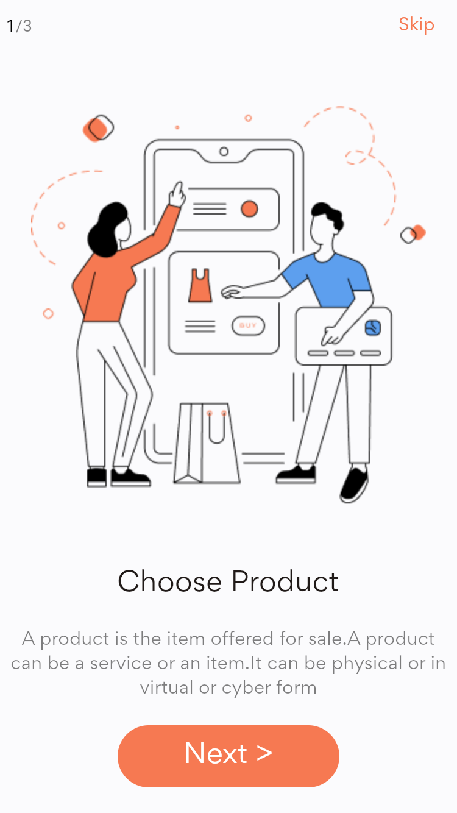
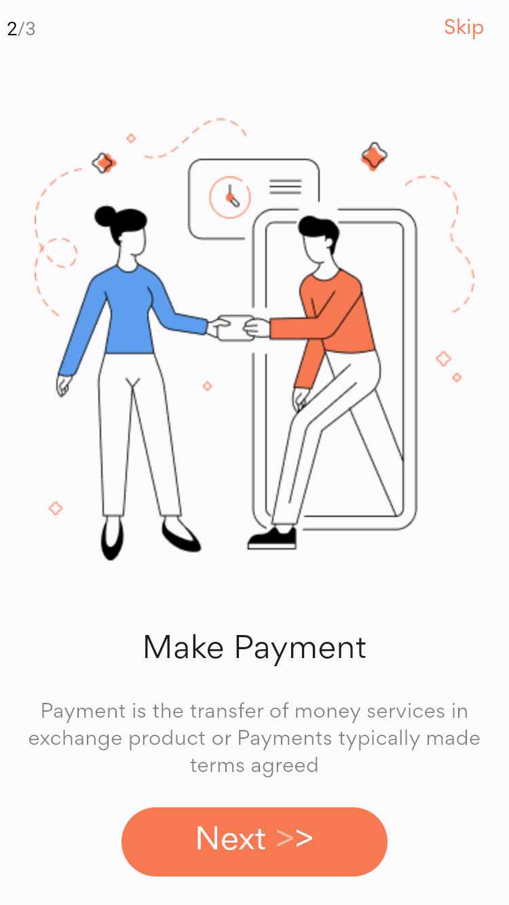
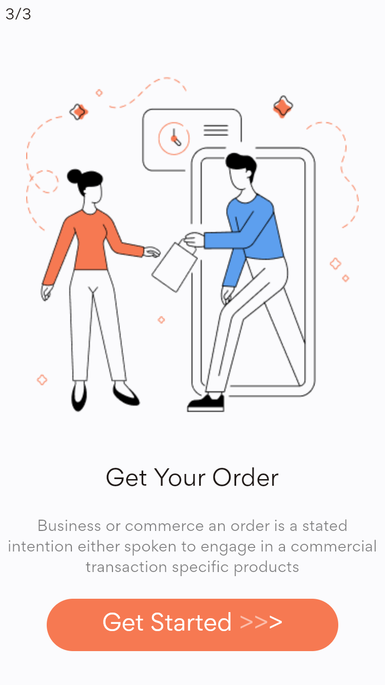
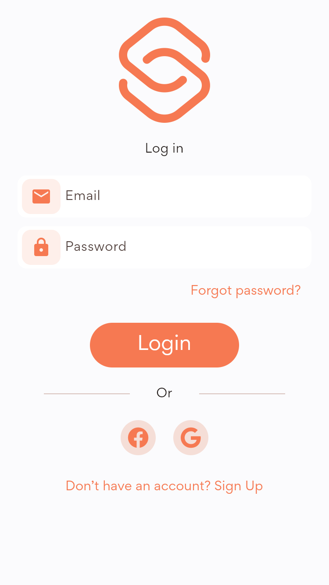
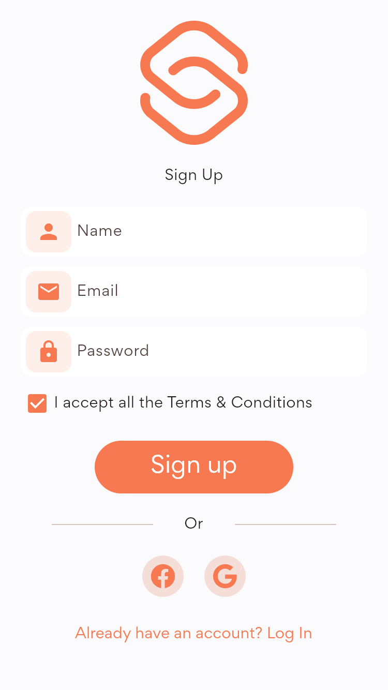
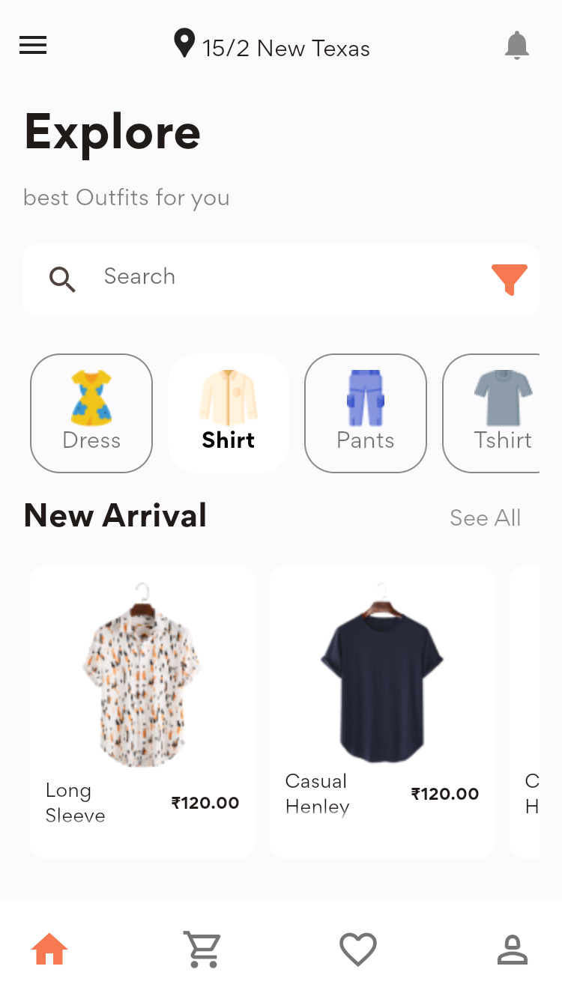
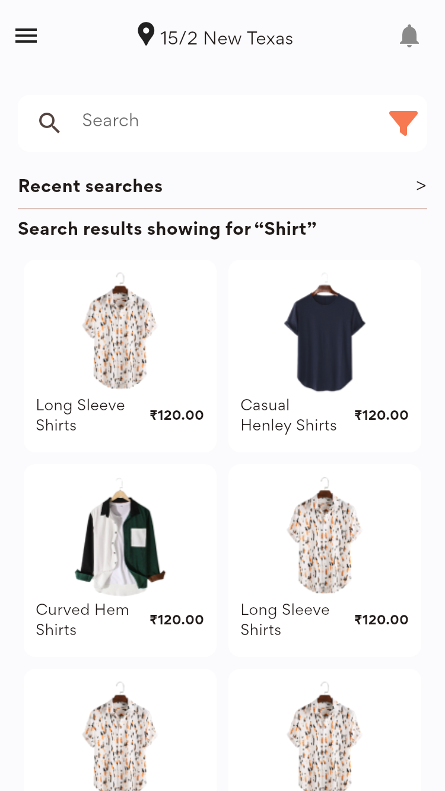

# 🫂 🧑🏿‍🤝‍🧑🏻 Clothing Ecommerce App - Alpha

One stop for all e-commerce needs

**Note:** More screens coming soon

------

# ✨ Requirements
- Any Operating System (ie. MacOS X, Linux, Windows)
- Any IDE with Flutter SDK installed (ie. IntelliJ, Android Studio, VSCode etc)
- A little knowledge of Dart and Flutter
- Device to test (Physical or Emulator or you can test on web too🤯)

------

# 📲 Device Requirements
- Android 22 and above for Android APK
- iOS 9 or above for iPhone
- Chrome 86 or Above for Chrome Browser
- Windows 10 or Above for Windows Desktop App
- MacOS 10.14 or Above for MacOS Desktop App

------

# 📸 Screenshots
The screenshots below are taken on a android emulator.

| 1                                                      | 2                                                      |
|--------------------------------------------------------|--------------------------------------------------------|
|  |  |

| 3                                                        | 4                                             |
|----------------------------------------------------------|-----------------------------------------------|
|  |  |

| 5                                                    | 6                                            |
|------------------------------------------------------|----------------------------------------------|
|  |  |

| 7                                                |
|--------------------------------------------------|
|  |

------

> **Disclaimer:** I am not in anyway in affiliate with the designer of the screens. I just love the UI and decided to code it in Flutter😽

------

# ♥ Credits
- https://figmaui4free.com/ecommerce-app-ui-kit-2/
